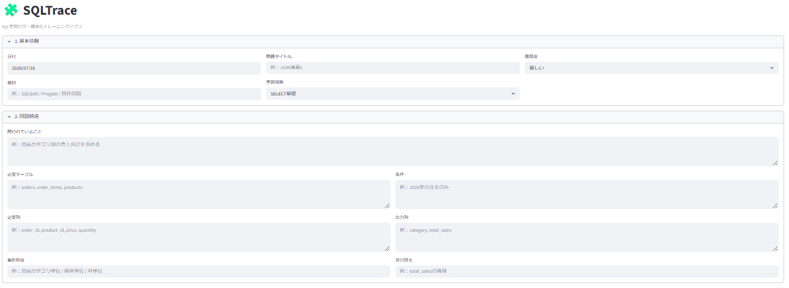
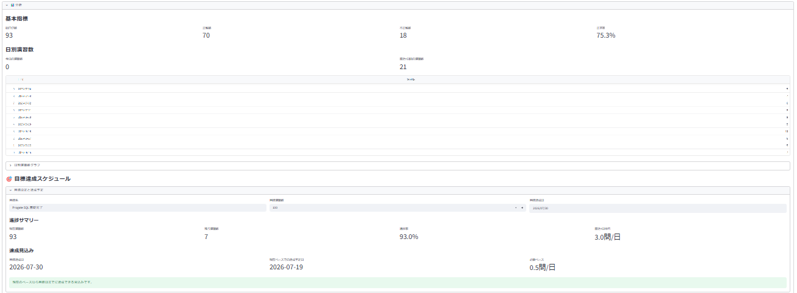
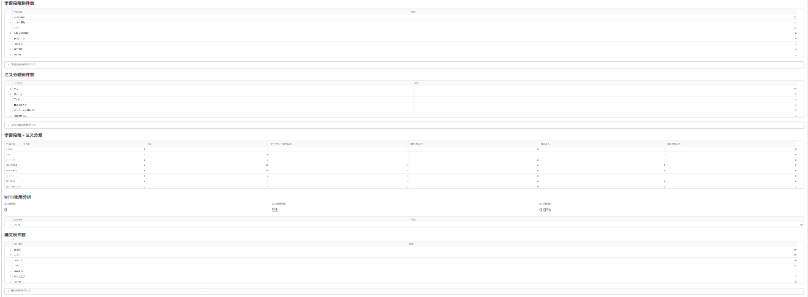
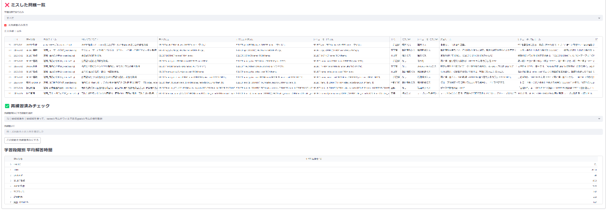

# SQLTrace

SQLTrace is a learning log and review support app for SQL practice, built with Python, pandas, and Streamlit.

## Overview

SQLTrace is a Streamlit app designed to record SQL learning logs, organize mistakes, and support review.

The app helps track what was asked in each SQL exercise, what SQL was written, what mistakes occurred, and what rule should be applied next time.

This project was created as part of my portfolio for learning support, problem-solving, and data-driven improvement.

## Purpose

The purpose of SQLTrace is to make SQL learning more structured and reviewable.

Instead of only solving SQL exercises, SQLTrace records the learning process itself, including:

- problem structure
- required tables and columns
- SQL written by the learner
- correct or improved SQL
- mistake type
- reason for the mistake
- next rule for review
- review status

By storing these logs, the app makes it easier to identify weak points and continue improving.

## Main Features

- Record SQL learning logs
- Save logs to CSV
- Review SQL mistakes
- Classify mistake types
- Record next review rules
- Track daily practice count
- Show recent practice progress
- Display mistake lists for review
- Manage reviewed / re-practiced items
- Connect SQL review content to TypeTrace for reproduction practice

## Technologies Used

- Python
- pandas
- Streamlit
- CSV
- GitHub
- Markdown

## How to Run

Install the required packages:

```bash
pip install -r requirements.txt
```

Run the Streamlit app:

```bash
streamlit run sqltrace_app.py
```

## Screenshots

### Input Form



### Analysis Summary



### Analysis Charts



### Mistake Review and Re-practice



## App Concept

SQLTrace focuses on the learning process behind SQL practice.

The core idea is:

```text
Solve SQL exercises
→ Record the structure and mistakes
→ Analyze weak points
→ Extract review targets
→ Re-practice and improve
```

## 日本語概要

SQLTraceは、SQL学習の記録・ミス分類・復習管理を行う学習支援アプリです。

SQL演習で「何を問われたか」「どのSQLを書いたか」「どのようなミスをしたか」「次回どのルールを意識するか」を記録し、pandasとStreamlitを用いて学習状況を可視化します。

このアプリは、SQL学習を単なる演習で終わらせず、ミス傾向の分析と再練習につなげることを目的に作成しました。
